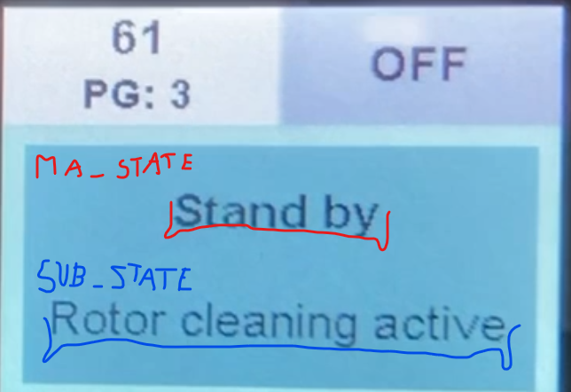
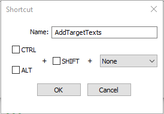

# Introduction
Python project to auto-comment a log files of R70 project.

# Table of contents
* [How to contribute](#How-to-contribute)
* [Environment setup](#Environment-setup)
* [Scripts](#Scripts)
    * [AddGuiTexts](##AddGuiTexts)
    * [AddMachineLogComments](##AddMachineLogComments)
    * [AddSucSiTexts](##AddSucSiTexts)
    * [AddTargetTexts](##AddTargetTexts)
* [Run from Notepad++](#Run-from-Notepad++)
* [Bonus - Notepad++ coloring](#Bonus-Notepad++-coloring)
* [Bonus - QCTerminal mask](#Bonus-QCTerminal-mask)
* [Contributor list](#Contributor-list)

# How to contribute
- follow a pattern, create new folder and script that search for regex string create a map file,
- add/modify to a map file state

# Environment setup
* Tool QCterminal from Uster Technologies AG
* For this application is recommended to use virtual environment. To setup venv follow instruction below.
* Application has been tested with version Python 3.11.7.

Note: Once environment is created, it is still needed to activate environment each time you open new terminal:
* Create virtual environment:
    ``` python -m venv venv ```
* Activate virtual environment:
    ``` .\venv\Scripts\activate ```

# Scripts
## AddGuiTexts
* This script is used to comment log from R70 SUC.
* It will append a GUI text comment to log message.
* 
* Example:
    * MA_STATE 8 received SubState 8
    * 
* Example:
    * You run logging to a file SUC_20241113.log using QCterminal tool.
    * Use debug mask 0x7f it will log messages like:
        * "DEB 17:24:07:170  MA_STATE 13 received SubState 6"
    * Running this script, a comment is appended
        * "<<< Process >, < YEP is active >>>"

* You can update comment strings in GUIStates.py.
* Used string are defined:
    * in project SC_newAPI\SW\Specific\SUC\ASW\GUI\Test.c:
    * "tGUIState GUIState"

* To run from notepad++ use:
    * ``` python {Your_path}\AnalyzeRxLogFiles\AddGuiTexts\AddGuiTexts.py "$(FULL_CURRENT_PATH)" ```
* Example:
    * ``` python C:\Users\urimrm\Projekty\Scripts\AddGuiTexts\AddGuiTexts.py "$(FULL_CURRENT_PATH)" ```

## AddMachineLogComments
* This script is used to comment log from R70 Machine.
* It will append a debug text comment to log message.
* 
* Example:
    * You download log files from machine log:
        * "DEB 09:59:40:047  Send_SUCSI_Ctrl_Msg: SUCSI msg 02, Data0 25, Data1 00"
    * Running this script, a comment is appended:
        * "<<< SUSI_STATE >, < YARNTRANSFER >>>"

* You can update comment strings in ./AddTargetTexts.py/MachineLogMap dictionary.

* To run from notepad++ use:
    * ``` python {Your_path}\AddMachineLogComments\AddMachineLogComments.py "$(FULL_CURRENT_PATH)" ```

* Example:
    * ``` python C:\Users\urimrm\Projekty\Scripts\AddMachineLogComments\AddMachineLogComments.py "$(FULL_CURRENT_PATH)" ```

## AddSucSiTexts
* This script is used to comment log from R70 SUC.
* It will append a SUCSI text comment to log message.
* 
* Example:
    * You run logging to a file SUC_20241113.log using QCterminal tool.
    * Use debug mask 0x7f it will log messages like:
        * "DEB 09:59:40:047  Send_SUCSI_Ctrl_Msg: SUCSI msg 02, Data0 25, Data1 00"
    * Running this script, a comment is appended:
        * "<<< SUSI_STATE >, < YARNTRANSFER >>>"

* You can update comment strings in SUCSIstates.py.

* To run from notepad++ use:
    * ``` python {Your_path}}\AddSucSiTexts\AddSucSiTexts.py "$(FULL_CURRENT_PATH)" ```
    * Example: ``` python C:\Users\urimrm\Projekty\Scripts\AnalyzeRxLogFiles\AddSucSiTexts\AddSucSiTexts.py "$(FULL_CURRENT_PATH)" ```

## AddTargetTexts
* This script is used to comment log from R70 SUC.
* It will append a full target text comment to log message.
* 
* Example:
    * You run logging to a file SUC_20241113.log using QCterminal tool.
    * Use debug mask 0x7f it will log messages like:
        * "DEB 09:59:40:046  StartPos(Target=0, Position=36000, Ctrl=0)"
    * Running this script, a comment is appended:
        * "<<< SWF_MTD - Measuringhead Traverse Drive >>>"

* You can update comment strings in search_target_texts dictionary.

* To run from notepad++ use:
    * ``` python {Your_path}\AnalyzeRxLogFiles\AddTargetTexts\AddTargetTexts.py "$(FULL_CURRENT_PATH)" ```
    * Example: ``` python C:/Users/urimrm/Projekty/Scripts/AnalyzeRxLogFiles/AddTargetTexts/AddTargetTexts.py "$(FULL_CURRENT_PATH)" ```

# Run from Notepad++
* There is some ways to run the scripts, but for me It was easy to use notepad++.
* Here is how I did it (click on script to run):
* 

* To add script (The Run > Run… menu entry launches the Run… dialog):
    * 
    * copy ``` python C:/Users/urimrm/Projekty/Scripts/AnalyzeRxLogFiles/AddTargetTexts/AddTargetTexts.py "$(FULL_CURRENT_PATH)" ```
    * Click the Save… button.
    * 
    * Click ok and Cancel.
    * To apply comment (The Run > AddTargetTexts) will apply script to currently open dialog.

# Bonus - Notepad++ coloring ✨
* Example:
    * 
* To distinguish between important messages create your own "programming language"
* 
* In notepad: (The Language > User Defined Language > Define your language...)
* 
* Now you know how and make your own configuration!!! 😎


# Bonus - QCTerminal mask ✨
* Tool QCterminal from Uster Technologies AG
* The most often for debug SUC I used these masks:
* 
* 

# Contributor list
- [Martin Imrich](https://linkedin.com/in/martin-imrich-2439921a8)
